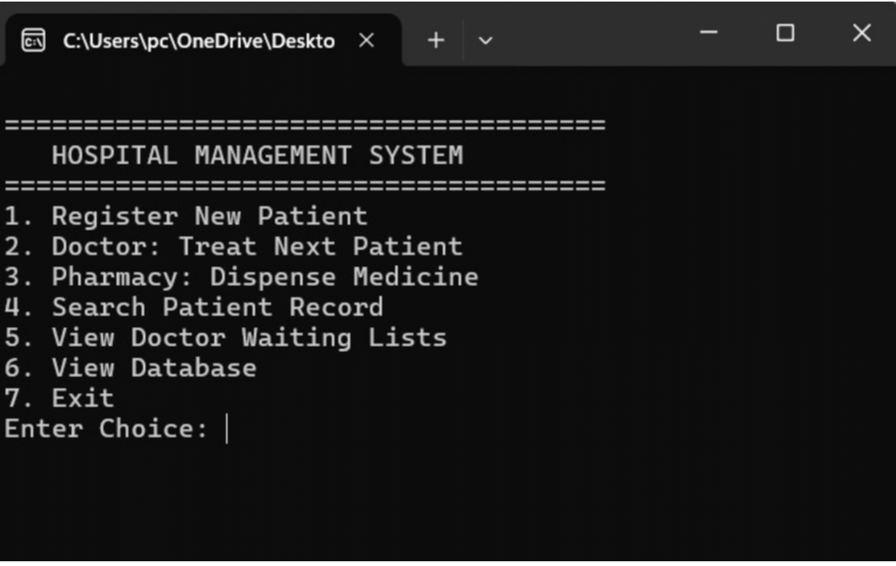
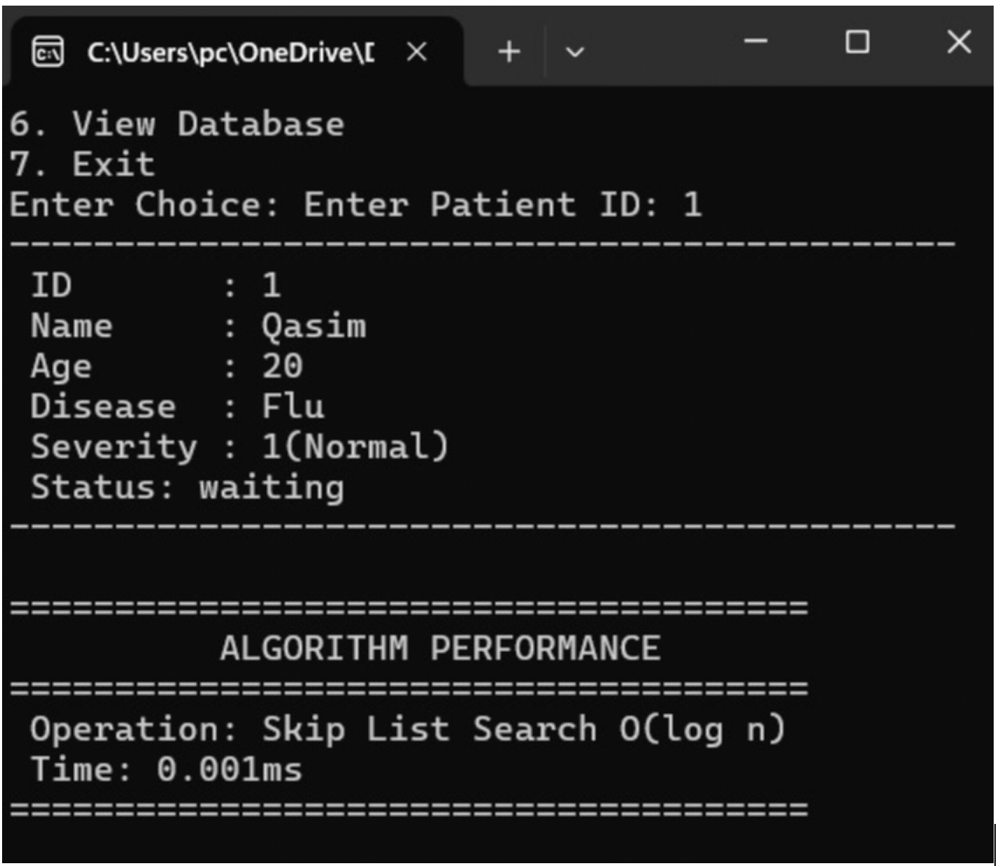

# 🏥 Hospital Patient Management System

A **C++ based Hospital Patient Management System** developed as a **Data Structures project**.
The system manages patient registration, emergency handling, and patient records using efficient data structures such as **Queue, Priority Queue, and Skip List**.

---

## 📌 Overview

Hospitals need efficient systems to manage patient flow, especially during emergency situations. Manual management can lead to delays and difficulty in maintaining patient records.

This project provides a structured solution for managing:

* 👤 Normal Patients
* 🚨 Emergency Patients
* 📋 Patient Records

using appropriate data structures for efficient processing and retrieval.

---

## 🎯 Objectives

* ✅ Develop a Hospital Patient Management System using C++
* ✅ Apply data structures to solve a real-world problem
* ✅ Manage normal patients using **Queue (FIFO)**
* ✅ Prioritize emergency patients using **Priority Queue**
* ✅ Store and search patient records efficiently using **Skip List**

---

## ✨ Features

* 📝 Patient registration
* 👨‍⚕️ Doctor consultation management
* 🚑 Emergency patient prioritization
* 👥 Normal patient queue management
* 🔎 Patient record searching
* 💊 Pharmacy processing
* 🏥 Patient discharge management

---

## 🧩 Data Structures Used

### 🔹 Queue

Used for managing normal patients.

* Follows the **FIFO (First In First Out)** principle
* The patient who arrives first is served first

---

### 🔹 Priority Queue

Used for handling emergency patients.

* Patients are assigned priority based on severity
* Higher priority patients are treated first regardless of arrival time

---

### 🔹 Skip List

Used for storing and searching patient records.

* Provides efficient insertion and searching
* Average search complexity: **O(log n)**

---

## 🛠️ Technologies Used

* 💻 C++
* 🧠 Data Structures
* 🖥️ Code::Blocks

---

## 📚 Concepts Implemented

* Object-Oriented Programming (OOP)
* Classes and Objects
* Header Files
* Dynamic Memory Management
* Queue Implementation
* Priority Queue Implementation
* Skip List Implementation
* Searching and Data Organization

---

## 📸 Screenshots

### 🏥 Main Menu

### 📋 Patient Record and Search using SkipList

---

## 🚀 Future Improvements

* 🌐 Add a graphical user interface (GUI)
* 💾 Connect with a database for permanent record storage
* 🔐 Add authentication for hospital staff
* 📊 Generate automated patient reports

---

## 👩‍💻 Author

**Sabeena Karam**
Developed using **C++**

